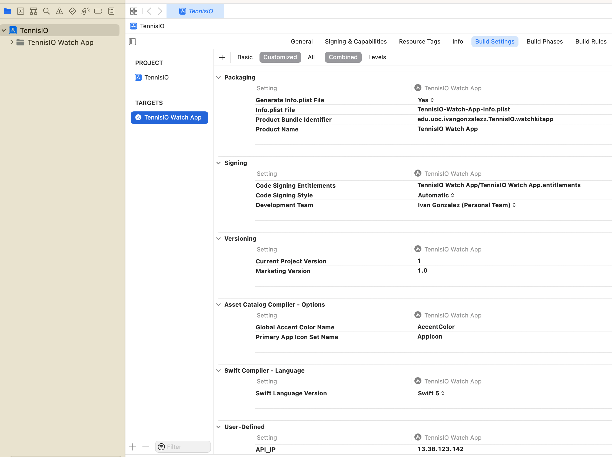
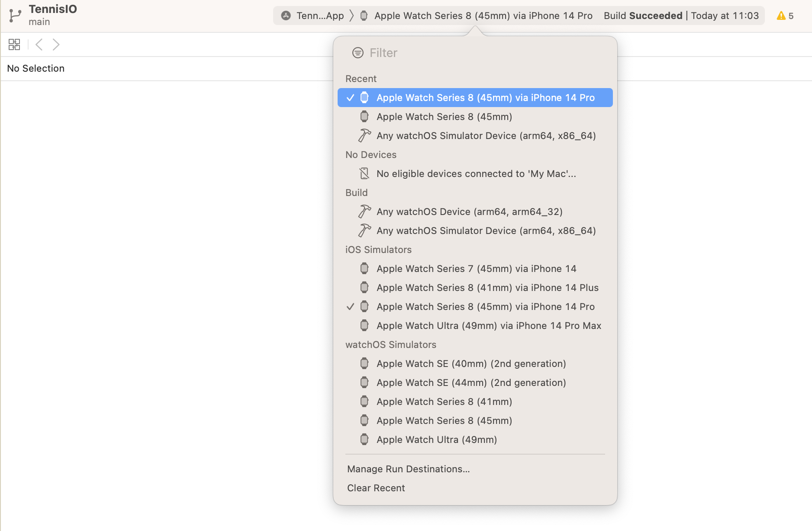
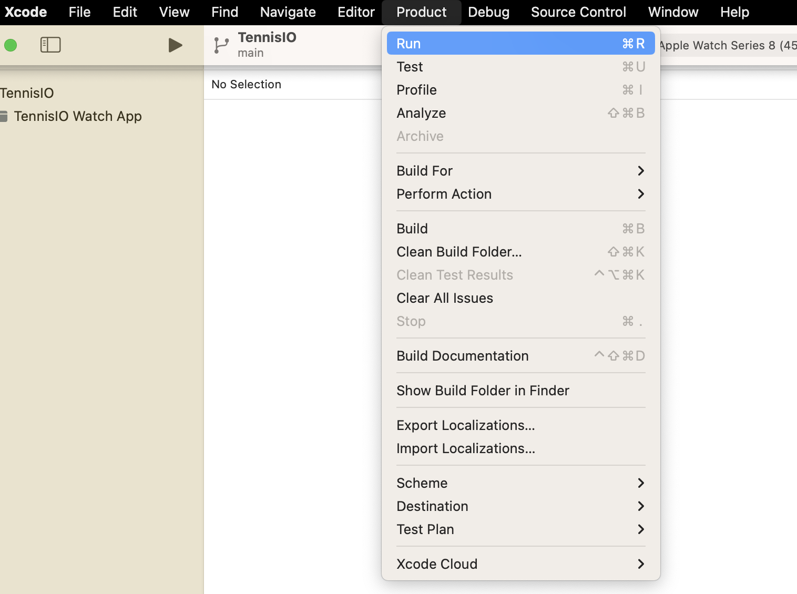
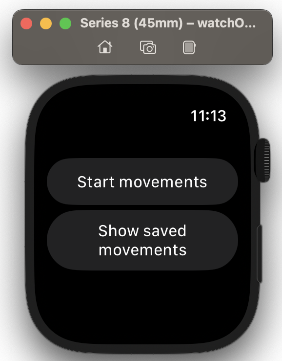

# TennisIO
WatchOS app to gather accelerometer, gyroscope and attitude data for Human Activity Recognition purposes

## Prerequisites
It's necessary to configure [TennisIOAPI](https://github.com/ivangonzalezz/TennisIOAPI) before running this app in order to extract data from the device.

## Installation
First, clone this repository:

```bash
git clone git@github.com:ivangonzalezz/TennisIO.git
```

Then, open Xcode and open the project cloned. 

If you need to extract data to the API, at target Build Settings, modify API_IP User-Defined setting:



Select the target device:



We can try to run the app. It will build it before running it on the device.



This will show on the device the app running. For example, here it's running at a simulator:


